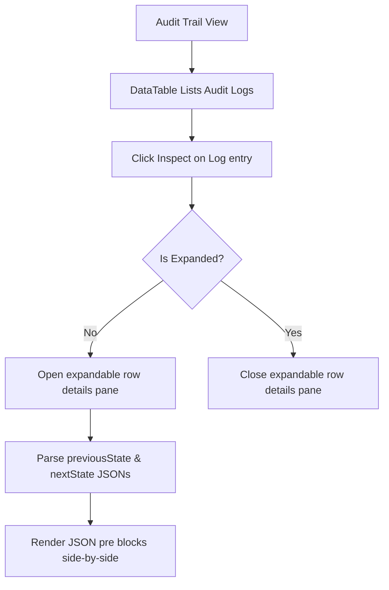

# Audit Page Documentation

System Audit Trail log viewer.

## Components & Structure
- **DataTable**: Lists logs, displaying Timestamp, Action Type, Entity Affected, ID, and Details inspection action.
- **Inspect Action**: Toggles an expandable row beneath the entry, rendering raw `previousState` and `nextState` JSON payloads side-by-side.

## Flow Diagram

