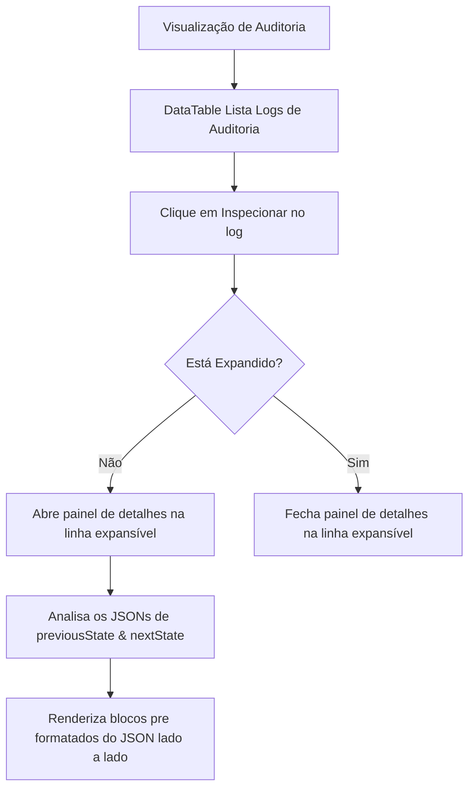

# Documentação da Página de Auditoria

Visualizador de registros da trilha de auditoria do sistema.

## Componentes e Estrutura
- **DataTable**: Lista logs, exibindo Data e Hora, Tipo de Ação, Entidade Afetada, ID e ação de Inspeção de Detalhes.
- **Ação de Inspeção**: Abre uma linha expansível abaixo do registro, renderizando os payloads JSON brutos do `previousState` (estado anterior) e `nextState` (próximo estado) lado a lado.

## Diagrama de Fluxo

