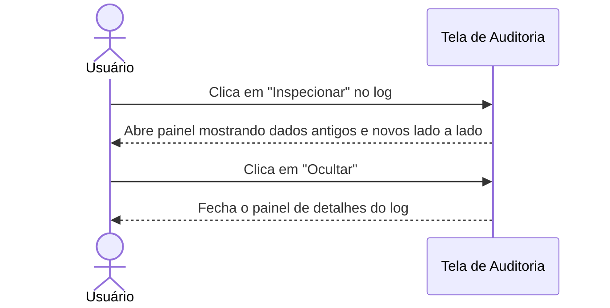
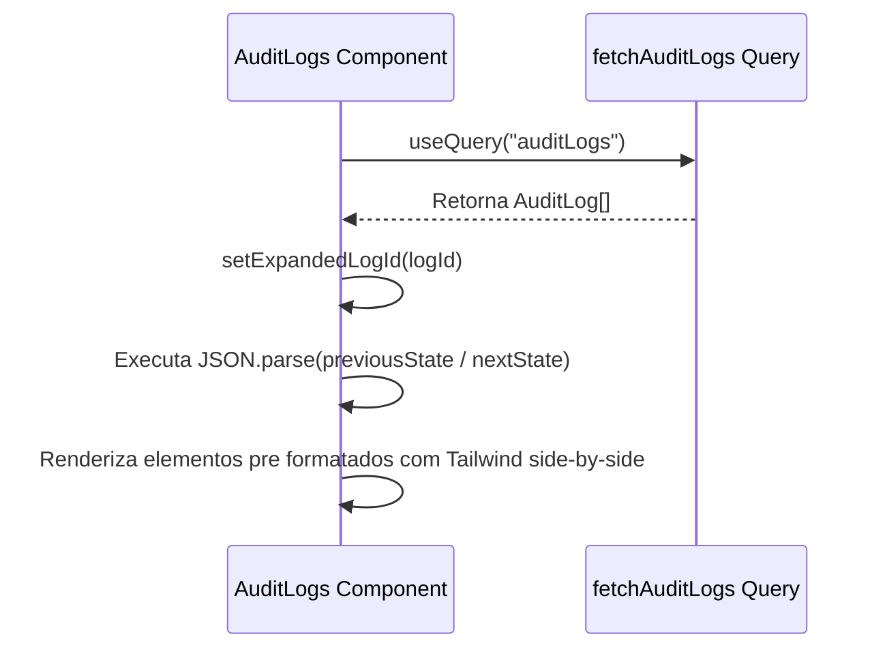

# Documentação da Página de Auditoria

Visualizador de registros da trilha de auditoria do sistema.

## Funcionalidades
- **Histórico de Logs**: Listagem completa e paginada de todas as mutações e transações executadas no sistema (criações de pedidos, atualizações de status).
- **Inspeção de Alterações**: Expansão de linhas individuais para inspeção de estados estruturados.
- **Comparação de Payload**: Visualização lado a lado (side-by-side) em formato JSON legível das diferenças exatas entre o Estado Anterior (`previousState`) e o Próximo Estado (`nextState`) do registro.

## Componentes e Estrutura
- **DataTable**: Lista logs, exibindo Data e Hora, Tipo de Ação, Entidade Afetada, ID e ação de Inspeção de Detalhes.
- **Ação de Inspeção**: Abre uma linha expansível abaixo do registro, renderizando os payloads JSON brutos do `previousState` e `nextState` lado a lado.

## Diagramas de Sequência

### 👥 Fluxo do Usuário (Não Técnico)

### ⚙️ Arquitetura e Fluxo Técnico

