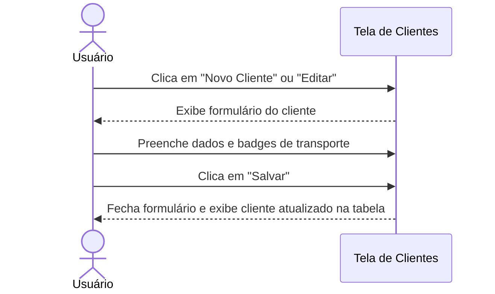
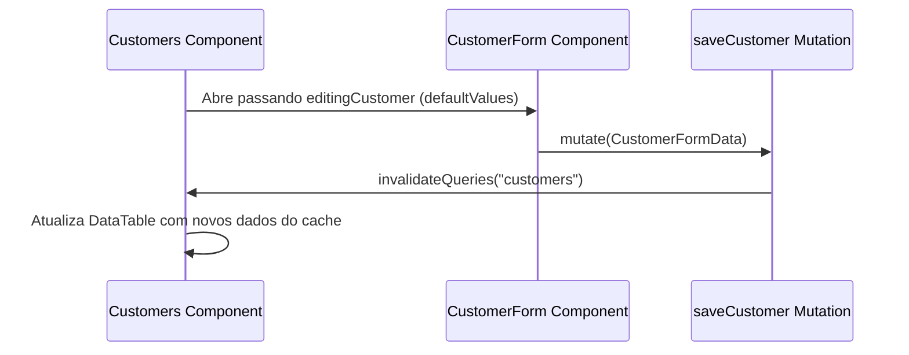

# Documentação da Página de Clientes

Gerenciamento de perfis e autorizações de logística.

## Funcionalidades
- **Listagem de Clientes**: Exibição em tabela com paginação sob demanda dos clientes cadastrados.
- **Cadastro e Edição**: Formulário expansível para criar novos perfis ou editar registros existentes (Nome, Tipo de Documento CNPJ/CPF e número correspondente).
- **Autorização Logística**: Associação de quais tipos de transporte cada cliente está autorizado a utilizar em suas respectivas entregas (gerenciados através de tags multi-selecionáveis).

## Componentes e Estrutura
- **Botão de Novo Cliente**: Abre o `CustomerForm` para criação.
- **CustomerForm**: Formulário retrátil para dados do cliente (Nome, Tipo de Documento, Número do Documento e tags de Transportes Autorizados).
- **DataTable**: Lista clientes com detalhes e ação de Editar.

## Diagramas de Sequência

### 👥 Fluxo do Usuário (Não Técnico)

### ⚙️ Arquitetura e Fluxo Técnico

