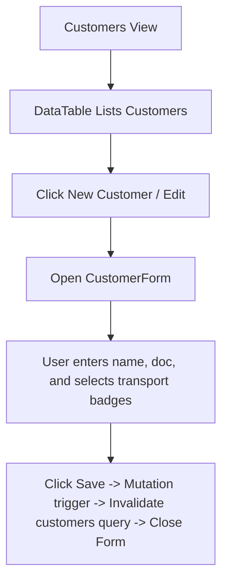

# Customers Page Documentation

Profiles and logistics authorization management.

## Components & Structure
- **New Customer Button**: Toggles `CustomerForm` for creation.
- **CustomerForm**: Collapsible form for customer details (Name, Document Type, Document number, and multi-select tags of Authorized Transports).
- **DataTable**: Lists customers with details and Edit action button.

## Flow Diagram

