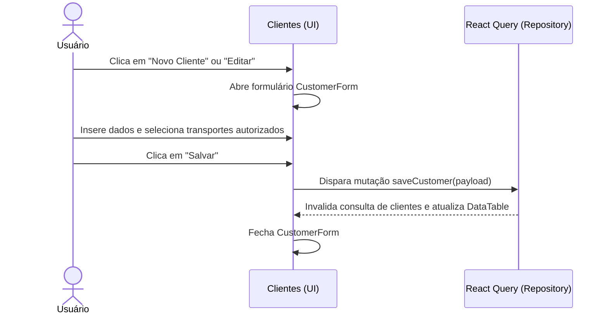

# Documentação da Página de Clientes

Gerenciamento de perfis e autorizações de logística.

## Componentes e Estrutura
- **Botão de Novo Cliente**: Abre o `CustomerForm` para criação.
- **CustomerForm**: Formulário retrátil para dados do cliente (Nome, Tipo de Documento, Número do Documento e tags multi-seleção de Transportes Autorizados).
- **DataTable**: Lista clientes com detalhes e ação de Editar.

## Diagrama de Fluxo (Sequência)

