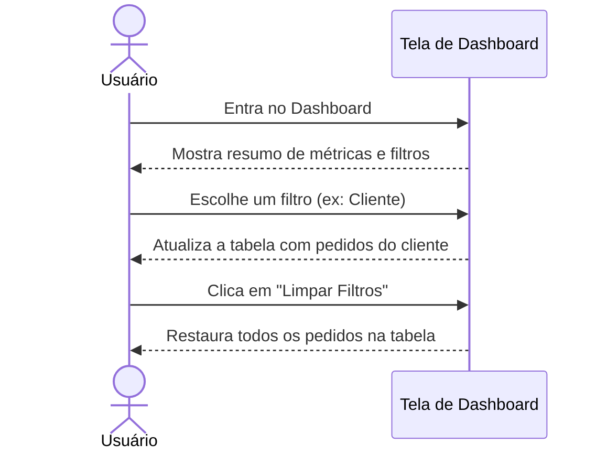
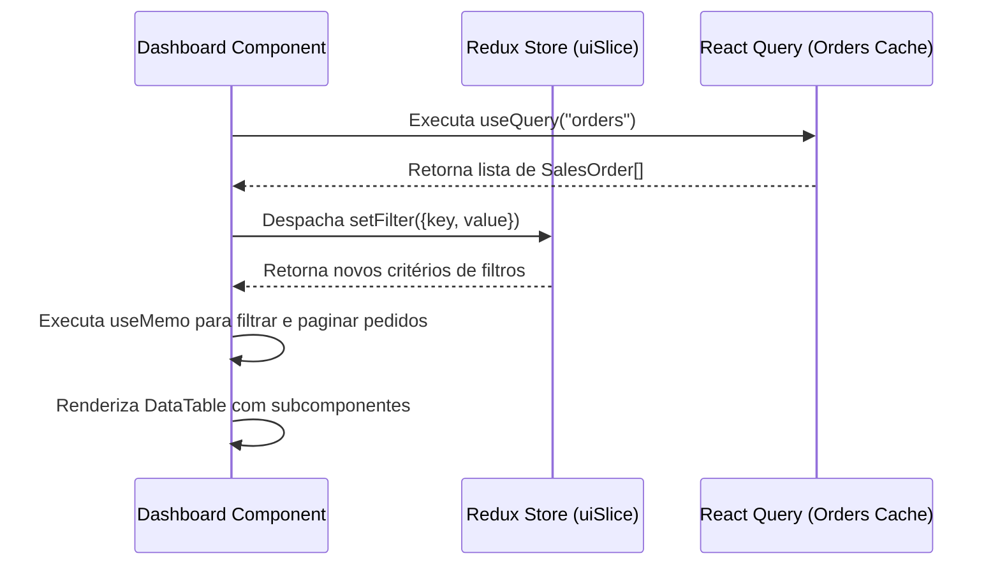

# Documentação da Página de Dashboard

Painel de monitoramento operacional contendo métricas, controles de filtro ativos e tabela paginada de Pedidos de Venda.

## Componentes e Estrutura
- **Cards de Métrica**: Total de Pedidos, Necessita Agendamento (PLANEJADA), Em Transporte (EM_TRANSPORTE) e Entregues (ENTREGUE).
- **Controles de Filtro**: Seleções para Status, Cliente, Modo de Transporte e DatePicker para Data de Criação.
- **DataTable**: Lista pedidos filtrados pela seleção, mostrando ID do Pedido, Cliente, Tipo de Transporte, Detalhes de Entrega e Status.
- **Rodapé de Paginação**: Controlador de paginação padrão com 8 itens por página.

## Diagramas de Sequência

### 👥 Fluxo do Usuário (Não Técnico)

### ⚙️ Arquitetura e Fluxo Técnico

