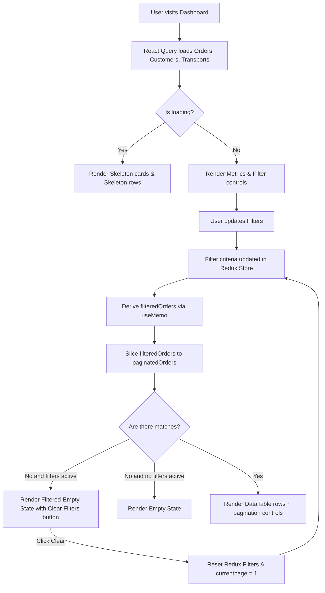

# Dashboard Page Documentation

Operational monitoring dashboard containing metrics, active filter controls, and paginated Sales Orders table.

## Components & Structure
- **Metric Cards**: Total Sales Orders, Needs Scheduling (PLANEJADA), In Transit (EM_TRANSPORTE), and Delivered (ENTREGUE).
- **Filter Controls**: Select dropdowns for Status, Customer, Transport Mode, and DatePicker for Creation Date.
- **DataTable**: Lists orders filtered by the selection, showing Order ID, Customer, Transport Type, Delivery details, and Status.
- **Pagination Footer**: Default 8 items per page pagination controller.

## Flow Diagram

