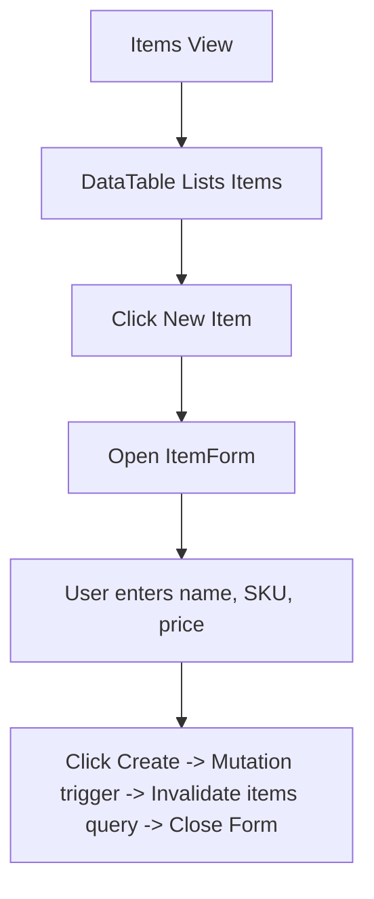

# Items Page Documentation

Order inventory items configurations.

## Components & Structure
- **New Item Button**: Opens `ItemForm`.
- **ItemForm**: Collapsible form for item details (Name, SKU, Price).
- **DataTable**: Lists items.

## Flow Diagram

