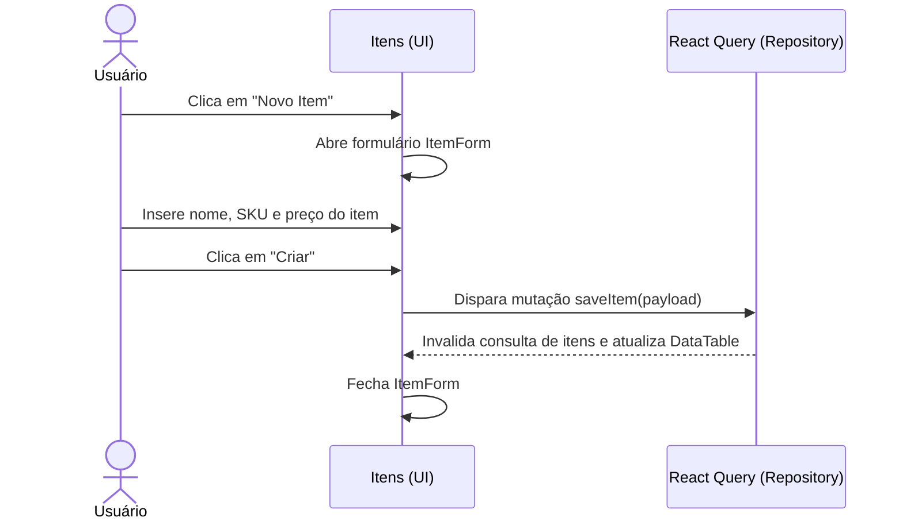

# Documentação da Página de Itens

Configurações de itens do inventário de mercadorias.

## Componentes e Estrutura
- **Botão de Novo Item**: Abre o `ItemForm`.
- **ItemForm**: Formulário retrátil para detalhes do item (Nome, SKU, Preço).
- **DataTable**: Lista itens.

## Diagrama de Fluxo (Sequência)

