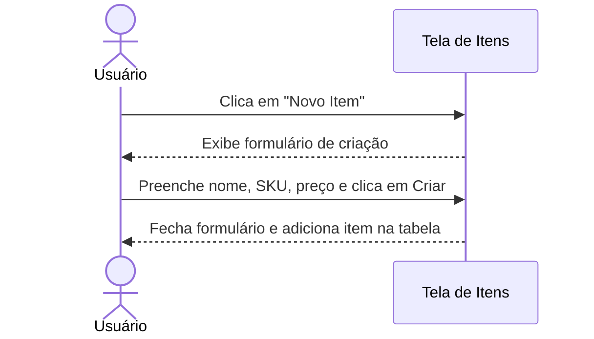
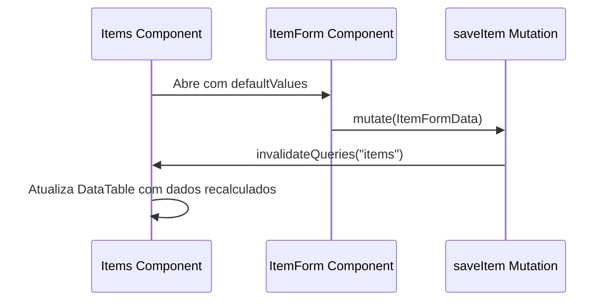

# Documentação da Página de Itens

Configurações de itens do inventário de mercadorias.

## Funcionalidades
- **Cadastro de Produtos**: Cadastro de novos produtos ou mercadorias informando Nome comercial, código único SKU e Preço Unitário de Venda.
- **Tabela de Inventário**: Visualização de preços e códigos SKU em formato estruturado.

## Componentes e Estrutura
- **Botão de Novo Item**: Abre o `ItemForm`.
- **ItemForm**: Formulário retrátil para detalhes do item (Nome, SKU, Preço).
- **DataTable**: Lista itens.

## Diagramas de Sequência

### 👥 Fluxo do Usuário (Não Técnico)

### ⚙️ Arquitetura e Fluxo Técnico

