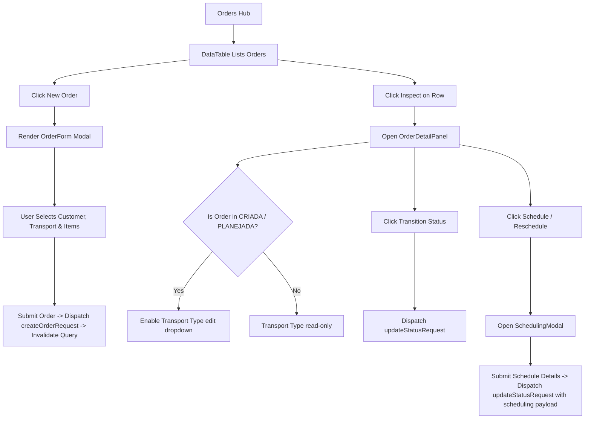

# Orders Page Documentation

Lifecycle management for Sales Orders, scheduling operations, and details inspections.

## Components & Structure
- **New Order Button**: Opens `OrderForm` to create orders.
- **DataTable**: Lists orders, displaying Order ID, Customer, Status, Order Total, and Inspect button.
- **OrderDetailPanel**: Appears side-by-side when an order is selected, displaying customer data, transport type selectors (for mutable states), items breakdown, and status transition controls.
- **SchedulingModal**: Modal form to specify delivery date and windows (morning/afternoon/night) for planned orders.

## Flow Diagram

