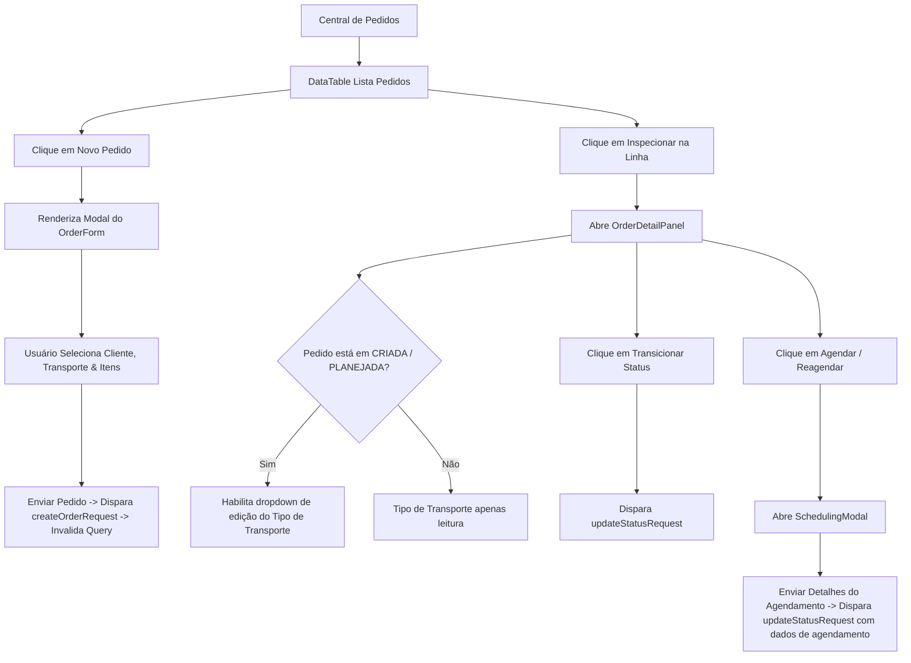

# Documentação da Página de Pedidos

Gerenciamento de ciclo de vida para Pedidos de Venda, operações de agendamento e inspeções de detalhes.

## Componentes e Estrutura
- **Botão de Novo Pedido**: Abre o modal `OrderForm` para criar pedidos.
- **DataTable**: Lista pedidos, exibindo ID do Pedido, Cliente, Status, Total do Pedido e botão de Inspecionar.
- **OrderDetailPanel**: Painel lateral que aparece quando um pedido é selecionado, exibindo dados do cliente, seleção de tipo de transporte (para estados mutáveis), detalhamento de itens e controles de transição de status.
- **SchedulingModal**: Modal para especificar a data de entrega e períodos (manhã/tarde/noite) para pedidos planejados.

## Diagrama de Fluxo

