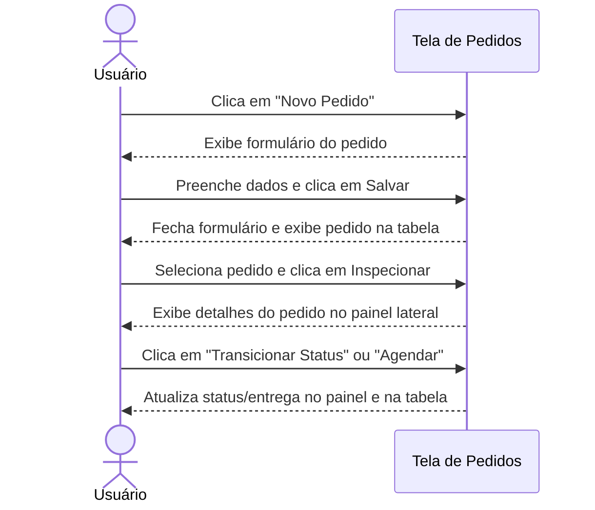
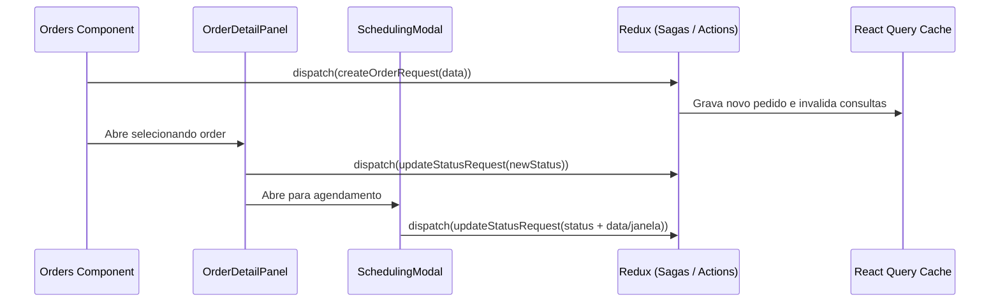

# Documentação da Página de Pedidos

Gerenciamento de ciclo de vida para Pedidos de Venda, operações de agendamento e inspeções de detalhes.

## Funcionalidades
- **Listagem de Pedidos**: Exibição paginada de todos os pedidos de venda do sistema com cálculo automático do total financeiro do pedido.
- **Criação de Pedidos**: Formulário completo para registrar novos pedidos, vinculando um Cliente, seu respectivo Tipo de Transporte e adicionando dinamicamente múltiplos itens com suas respectivas quantidades.
- **Inspeção de Pedido**: Painel lateral detalhado exibindo informações do cliente, checklist de itens com preços parciais e históricos de entrega.
- **Edição de Transporte**: Troca dinâmica de tipo de transporte diretamente no painel de detalhes (permitido apenas nos status mutáveis iniciais CRIADA ou PLANEJADA).
- **Transição de Status**: Fluxo de avanço do ciclo de vida operacional do pedido.
- **Agendamento de Entrega**: Definição da data e janela horária (Manhã, Tarde ou Noite) para a entrega da mercadoria.

## Componentes e Estrutura
- **Botão de Novo Pedido**: Abre o modal `OrderForm` para criar pedidos.
- **DataTable**: Lista pedidos, exibindo ID do Pedido, Cliente, Status, Total do Pedido e botão de Inspecionar.
- **OrderDetailPanel**: Painel lateral que aparece quando um pedido é selecionado, exibindo dados do cliente, seleção de tipo de transporte, detalhamento de itens e controles de transição de status.
- **SchedulingModal**: Modal para especificar a data de entrega e períodos para pedidos planejados.

## Diagramas de Sequência

### 👥 Fluxo do Usuário (Não Técnico)

### ⚙️ Arquitetura e Fluxo Técnico

