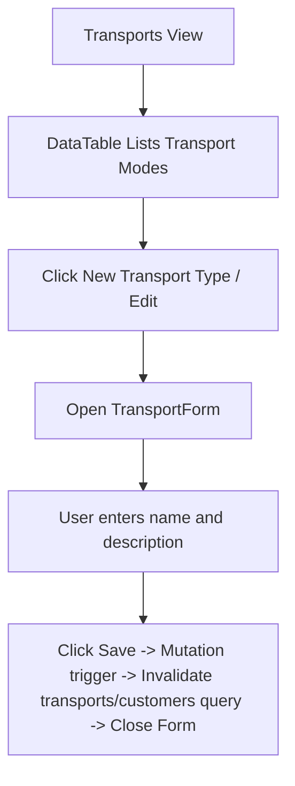

# Transports Page Documentation

Logistics transport mode configurations.

## Components & Structure
- **New Transport Type Button**: Opens `TransportForm`.
- **TransportForm**: Collapsible form for details (Name, Description).
- **DataTable**: Lists transport modes with Edit action.

## Flow Diagram

