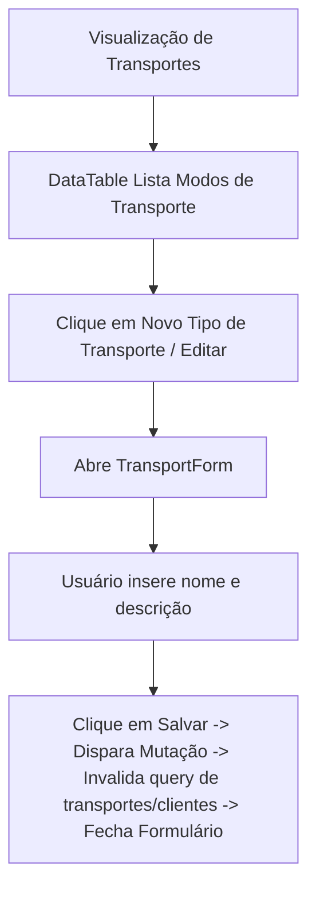

# Documentação da Página de Transportes

Configurações de modos de transporte logístico.

## Componentes e Estrutura
- **Botão de Novo Tipo de Transporte**: Abre o `TransportForm`.
- **TransportForm**: Formulário retrátil para detalhes (Nome, Descrição).
- **DataTable**: Lista modos de transporte com ação de Editar.

## Diagrama de Fluxo

