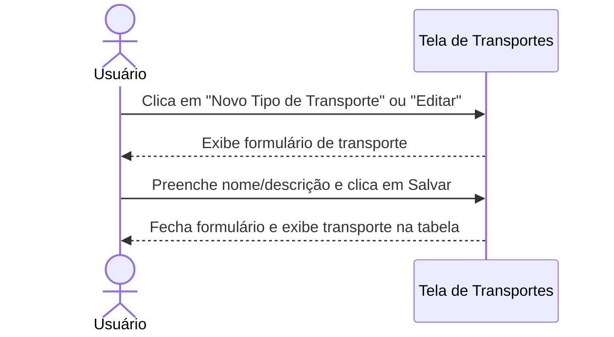
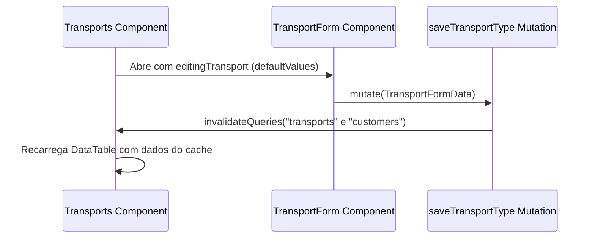

# Documentação da Página de Transportes

Configurações de modos de transporte logístico.

## Funcionalidades
- **Configuração de Modos**: Cadastro de novas categorias ou tipos de veículos logísticos autorizados no fluxo operacional.
- **Edição Cadastral**: Atualização rápida de nomes ou descrições dos tipos de transportes.
- **Tabela Paginada**: Visualização consolidada dos tipos com limite de itens configurável.

## Componentes e Estrutura
- **Botão de Novo Tipo de Transporte**: Abre o `TransportForm`.
- **TransportForm**: Formulário retrátil para detalhes (Nome, Descrição).
- **DataTable**: Lista modos de transporte com ação de Editar.

## Diagramas de Sequência

### 👥 Fluxo do Usuário (Não Técnico)

### ⚙️ Arquitetura e Fluxo Técnico

